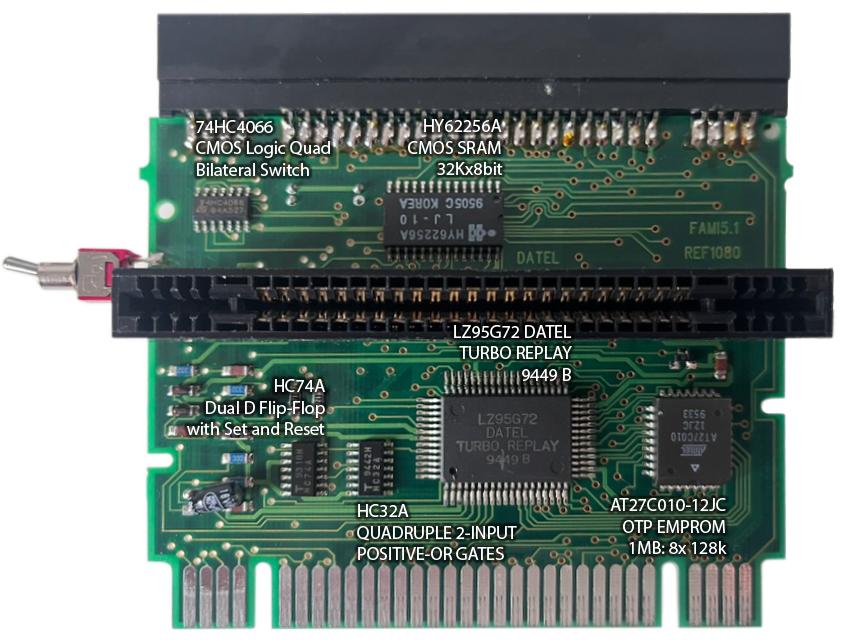

# Home of Pro Action Replay MK III for SNES:
## The Ultimate Documentation Hub

---

### Discover the Full Power of the Action Replay MK3!

Finding in-depth information (or even basic manuals) for this Super Nintendo cheat device is difficult. Here you find:
- revised and up-to-date manuals (de/en)
- print-ready repro labels
- further information on the built-in code database
- project "Preservaction" - documentation of PAR MK III
- comparison to other cheat-devices or SNES region adapters

The Pro Action Replay MK III is my favorite SNES cheat device because it's much more like a Swiss Army knife:
- a region adapter
- a cheat code device
- a cheat code finder (trainer)
- a cheat code database
- a mouse or joypad-driven user interface

### Why did you make this?

I've been collecting SNES equipment for over 20 years and spent a long time researching which region adapter might be the best. The search wasn't easy, as there isn't much information about it online. Then I came across a forum post that mentioned the Action Replay MKIII - which made me curious, as I already owned this cheat device. Was there a function I had overlooked!?

**Indeed!** The MK III isn't just a cheat device but also an excellent region adapter. Apparently, it's the only one that can play SMRPG (Super Mario RPG) on European consoles! I was also amazed to find out that it can convert Game Genie codes! But there was more: it was supposed to have a built-in code database. Could that really be?

Yes, it could. I hadn't read the manual, which, to be honest, was (and still is) quite a pain! *Printed way too small, unillustrated, full of typos, and barely formatted.*

Long story short: the MK III is my absolute favorite cheat module - it's basically the Swiss Army knife of SNES modules! And very few people know it. To make this amazing hardware appreciated again, I digitized and translated the manual, documented all the built-in codes, screenshotted each menu, and gathered more information.

Do you think you don't need a cheat-code device because your Super NT, MiSTer, or cheap emulator has a cheat-code menu? That's a shame because the **MK III is still a lot of fun, even on modern hardware!** Hopefully, anyone else who likes this module and lacks the manual will find what they need here. And maybe I've inspired someone else to appreciate this fantastic piece of hardware...

Happy gaming (or cheating)

*Tim*

## Downloads

### Manuals

The original manual contains several small errors, and a revised version is available for download. Since the module's interface is in German, I have provided a translation. However, only the body text has been translated – the menu names and messages have been kept in the original language for better orientation.

- [Manual (German, revised V2.1)](manual_de.md)
- [Manual (English, translation V2.1)](manual_en.md)

### Cartridge Labels (Repros)

To give your Action Replay MK III module an authentic look, we've provided high-resolution label downloads for printing. These are faithful recreations of the original labels and are available in case your module's label has been damaged and needs replacing:

- [Module Label (PNG)](./assets/action_replay_mk_iii_label.png)
- [Module Label (PDF)](./assets/action_replay_mk_iii_label.pdf)
- [Module Label (Adobe Illustrator 2024)](./assets/action_replay_mk_iii_label.ai)

### Project 'Preservaction'

Since no (or very little) information, screenshots, and other details are available, I think it is important to preserve the Pro Action Replay 3 details. Therefore I started this project to document all functions of the Action Replay MK III - from the interface and operation to features hidden within the ROM. Why not go to [Project Preservaction](project-uip-toc.md)?

### All about DEADC0DE

Different from the regular cheatcodes you find `DEADC0DES` for the Action Replay beginning from MK II. They look very unusual, but a quick google research shows: Nothing.

This is interesting! A challenge! Why hasn’t anyone delved into this yet? Oh, the nerd in me must have awakened. If you’re interested in what deadcodes are (they’re awesome, I can already tell you), check out the corresponding archive [with all the details](project-uip-deadc0de.md).

### Built-In Codes

The Action Replay MK III includes a built-in database of (cheat) codes. A total of `907` codes for `202` games are pre-installed on the module (version `V1.0G`). Alongside classics like A Link to the Past, Castlevania, Final Fight, and Street Fighter, it also features cheats for games that only later achieved cult status and are now considered “hidden gems” or “underrated”: such as Blackthorne, Goof Troop, Lost Vikings, and Mickey's Magical Quest.

Due to limited storage space, only the most essential codes were included, such as infinite lives, energy, or time. Additionally, there are codes that support region unlocking, effectively patching the software in real-time.

See a [list of all included games](code-database.md) and cheat codes.

Interestingly, there are **a few oddities**:
- `Mega lo Mania` is listed mistakenly as `Mage Lo Mania`.
- `Sküljagger: Revolt of the Westicans` is listed mistakenly as `Skulljagger`.
- `Eek! The Cat` is listed in the cheat code database mistakenly as `Sky Cat`.
- `Rampart` is listed mistakenly as `Ramparts`.
- The [cheat codes for `Street Racer`](./ui/cheats/170b-codes-street-racer-4.png) are labeled mistakenly as `No Description`.
- Some games are listed with their Japanese or European name, but not marked with "`JAP`" or "`EU`" as other games are. This leaves the version unclear:
  - `Contra Spirits` (JAP) = `Contra III: The Alien Wars` (US)
  - `Dead Dance` (JAP) = `Tuff E Nuff` (US)
  - `Super SWIV` (JAP) = `Firepower 2000` (US)
  - `Wild Trax` (JAP) = `Stunt Race FX` (US)
  - `Desert Fighter` (EU) = `A.S.P.: Air Strike Patrol` (US)
  - `Mega lo Mania` (EU) = `Tyrants: Fight Through Time` (US)
  - `Rival Turf!` (INT) = `Rushing Beat` (JAP)
  - `Rushing Beat Shura` (JAP) = `Brawl Brothers` (US)
  - `Super Aleste` (JAP) = `Space Megaforce` (US)
  - `Super Pang` (JAP) = `Super Buster Bros` (US)

Along with **some misleading simplifications**:
- `90 Minutes - European Prime Goal` is listed as `Prime Goal`.
- `Harley's Humongous Adventure` is listed as `Harleys Humongous Advent`.
- `The Legend of Zelda - A Link to the Past` is listed as `Zelda III`.

#### More (Cheat-)Codes!

If you're looking for even more codes beyond what's built-in, check out [the SNES area at gamehacking.org](https://gamehacking.org/system/snes/), an excellent resource with a vast collection of codes for the SNES, including games that may not be covered by the built-in database. 

## Further Insights

In addition to the main information about the MK III features, I’ve also compiled other interesting insights about the cheat device that caught my attention during my research.

### Game Converters and Adapters

Many people search the internet for help finding a well-functioning cartridge adapter to play games from another region on a Super Nintendo. There are certainly a few decent options, but the best one is the Action Replay MK III. Most adapters don’t support complex late-release games, don’t pass through the cartridge’s enhancement chips, and so on.

| **Adapter Name**                          | **Region** | **Slot Type** | **Cart-Slots** | **PAR** | **GG** | **DB** | **Slomo** | **ROM** | **CIC** |
|-------------------------------------------|------------|---------------|----------------|---------|--------|--------|-----------|---------|---------|
| Game Converter / Fire (MD-303)            | INT        | simple        | 2              | 0       | 0      | -      | -         | -       | -       |
| Game Converter / Fire FX (MD-909)         | EU         | extended      | 2              | 0       | 0      | -      | -         | -       | -       |
| AD-29 Universal Adapter                   | INT        | extended      | 2              | 0       | 0      | -      | -         | -       | -       |
| AD-29 Universal Adapter (Upgrade Version) | INT        | extended      | 2              | 0       | 0      | -      | -         | -       | -       |
| Multi Converter (DIS-SFC01)               | INT        | simple        | 2              | 0       | 0      | -      | -         | -       | -       |
| Pro Universal Adapter                     | INT        | extended      | 2              | 0       | 0      | -      | -         | -       | -       |
| Universal Adapter                         | INT        | simple        | 2              | 0       | 0      | -      | -         | -       | -       |
| Universal Adapter Expert Version          | INT        | extended      | 2              | 0       | 0      | -      | -         | -       | -       |
| Super Game Key                            | INT        | simple        | 2              | 0       | 0      | -      | -         | -       | -       |
| Super Key (Universal Adapter)             | INT        | extended      | 1              | 0       | 0      | -      | -         | -       | Yes     |
| Super Magic Key                           | EU         | simple        | 2              | 0       | 0      | -      | -         | -       | -       |
| Honey Bee                                 | EU/NA      | simple        | 2              | 0       | 0      | -      | -         | -       | -       |
| Honey Bee (Super-Magic Game Converter)    | NA         | extended      | 2              | 0       | 0      | -      | -         | -       | -       |
| Honey Bee (Super-Magic Game Converter)    | EU         | simple        | 2              | 0       | 0      | -      | -         | -       | -       |
| Programmable Universal Adapter            | EU         | extended      | 2              | 1       | 0      | -      | -         | -       | -       |
| Action Replay                             | INT        | simple        | 1              | 4       | 0      | -      | -         | -       | -       |
| Pro Action Replay MK1                     | INT        | extended      | 2              | 20      | 0      | Yes    | -         | -       | -       |
| Pro Action Replay MK2 (1.0, 2.P, 2.T)     | INT        | extended      | 2              | 100     | 0      | Yes    | Yes       | Yes     | -       |
| Pro Action Replay MK3                     | INT        | extended      | 2              | 100     | 5      | Yes    | Yes       | Yes     | -       |
| Analogue Super NT                         | INT        | extended      | 1              | 0       | 6      | -      | -         | -       | FPGA    |
| Hyperkin Retron 5                         | INT        | extended      | 1              | `Raw`   | `Raw`  | -      | Yes       | -       | Emu     |
| Hyperkin SupaBoy                          | INT        | extended      | 1              | 0       |        | -      | Unknown   | -       | Emu     |

> Why is MiSTer not listed in this section? Well, MiSTer is a cool device (specialized in ROMs), but has no cartridge slot.

> Credits/Source:
    (1) [Reddit](https://www.reddit.com/r/snes/comments/v83p0f/pro_action_replay_confusion/)
    (2) [SNES Central](https://snescentral.com/article.php?id=0798)
    (3) [GameFAQs](https://gamefaqs.gamespot.com/snes/916396-super-nintendo/faqs/11640)

#### Legend

- **Region:** 
  - **INT**: International (incl. JP)
  - **EU/NA**: North America (without JP)
  - **EU**: Europe
  - **NA**: North America
  - **JP**: Japan

- **Slot Type:** 
  - **simple**: Simple contacts (no enhancement chips supported)
  - **extended**: Extended contacts (some or all enhancement chips supported)

- **Cart Slots:** 
  - **1**: Single Slot
  - **2**: Dual Slot (one for local CIC 'donation' cartridge)

- **Cheat Codes:**
  - **PAR**: Pro Action Replay cheat codes supported (and how many)
  - **GG**: Game Genie cheat codes supported (and how many)
  - **Raw**: Raw cheat codes (from gamehacking) supported, no limit known
  
- **Special Features:**
  - **DB:** Indicates whether a cheat code database is integrated
  - **Slomo:** Indicates whether slow motion is integrated
  - **ROM:** Indicates whether ROM cheat codes are supported
  - **CIC:** Indicates whether a CIC chip is integrated
  
### Secrets

#### Credits/Informations

Hold `A` as the Action Replay logo fades out to display a credits/information screen. This screen contains the program version, copyrights, build date, and checksum. While at this screen, the two cartridge `LEDs` will strobe.

> Note: [Credits/Source](https://tcrf.net/Pro_Action_Replay_MK3_(SNES))

#### Test Mode

Hold `Y` # `A` while booting/restarting the menu to enter a simple test mode. From here, pressing `B` will light up the two cartridge `LEDs` and then start the attached game with the code `7E001902` active.

> Note: [Credits/Source](https://tcrf.net/Pro_Action_Replay_MK3_(SNES))

#### Unused Routines

At CPU address `00D48B` (right after the text for the credits/info screen) is the string "THIS IS THE START OF THE END", followed by some no-longer-used routines which attempt to poll the values at CPU addresses `00D500` through `00D50F` as part of some unknown functionality.

### Module Overview: Front and Back Elements

Below are images of the *Action Replay MK III* module showing its front and back:

#### Front View

- **Switch**: This switch toggles the activation of the Action Replay's cheat functions.
- **LED A & LED B**: The two LEDs indicate the status of the module when it's active and when cheats are applied.
- **Cartridge Slot on Top**: This is where you insert your SNES game cartridge to enable cheats and region-free functionality.

#### Back View

- **Card Slot on Back**: This slot is essential when using a game from a different region. To enable compatibility with certain expansion chips (such as those used in certain region-specific games), you will need to insert a **donor module** in this slot. The donor module provides the necessary additional chips required for the imported game to run correctly on the SNES console. 

#### PCB

**Download:** [PCB-Image without descriptions](./assets/pcb-pure.png)

- **74HC4066 - CMOS Logic Quad Bilateral Switch:** The 74HC4066 is a logic IC containing four bidirectional switches. It’s often used in digital circuits to selectively switch and route signals. In this module, it may be used to switch between different signal paths or data sources depending on the switch position or selected functions.

- **HY62256A - CMOS SRAM 32Kx8bit:** This is a static RAM (SRAM) chip with a storage capacity of 32 kilobytes, organized in 32Kx8-bit cells. SRAM chips store data temporarily and are ideal for holding cheat data, settings, or intermediate values for parameters in real-time. Here, it could be used to store cheats or modified values for games, which are then applied directly to the console.

- **LZ95G72 - DATEL TURBO REPLAY:** The LZ95G72 is the heart of the module and is likely a specialized microcontroller or custom IC from DATEL, designed specifically for cheat and region-bypass functions. It processes the entered cheats, manages the interfaces to other chips, and controls the module’s overall functionality.

- **HC74A - Dual D Flip-Flop with Set and Reset:** The HC74A is a Dual D Flip-Flop IC, used in digital circuits to store and stabilize states. The Flip-Flop can be controlled by set and reset signals, and could be used here to store cheat states (e.g., which cheats are active), keeping them consistent even through game inputs.

- **HC32A - Quadruple 2-Input Positive-OR Gates:** This chip contains four 2-input OR gates and is a logic component used to combine signals based on OR logic in digital circuits. It might be used to combine logic signals required for activating cheats or controlling certain module settings.

- **AT27C010-12JC - OTP EPROM 1MB:** The AT27C010 is a one-time programmable memory chip (EPROM) with a storage capacity of 1 Megabit. It is used to store the hard-coded programs and data for the module, such as the firmware, user interface, and potentially pre-installed cheat codes. The EPROM contains the main program that controls the module’s behavior.

##### 3-Way Toggle Switch and Its Functions

The **3-way toggle switch** on the side of the Pro Action Replay MK III module controls the different operating modes of the module and allows switching between the following positions:

1. **Top Position:**
   - This position activates **parameters**, the **slow-motion function**, and the **trainer**. In this mode, cheats can be applied, and the game can be slowed down using the slow-motion feature.
   - During gameplay, the trainer can be used to locate memory addresses for specific values (e.g., lives or energy) and adjust them.

2. **Middle Position:**
   - This position turns off the Action Replay, placing it in pass-through mode. The game runs unmodified without any cheat or modification functions.
   - This is the default mode when no modifications to the game are desired.

3. **Bottom Position:**
   - This position enables the **parameter input mode** and displays the Action Replay’s main menu. In this mode, users can enter cheat codes, activate the adapter function for games from other regions, and adjust other settings.
   - Through the menu, parameters can be selected or entered, which will later be applied in cheat mode.

##### Hypothetical Analysis of Chip Interaction

Based on the known functions of the module and the analyzed hardware, the following explanation is purely **speculative** about how the chips might work together:

- **Signal Flow and Mode Control:** The **74HC4066** is likely controlled by the 3-way switch and acts as a central switch for the various modes. Depending on the switch position, it routes signals and determines which chips are active. For example, in the top position, it might activate cheat signals, in the middle position disable cheats, and in the bottom position enable menu access.

- **Processing and Control by the Main Chip:** The **LZ95G72** acts as the central control unit, coordinating the cheat and region-bypass functions. It reads data from the EPROM and activates or deactivates the SRAM and other chips depending on the selected mode. In combination with the **HC74A** Flip-Flop, it keeps track of active cheats and applies them consistently during gameplay.

- **Memory and Logic Processing:** The **HY62256A (SRAM)** temporarily stores active cheat data and settings that the module applies during gameplay. The **HC32A** OR gate chip combines logic signals to determine if a cheat is active and if the Action Replay should actively modify the game code.

- **Storage and Program Access:** The **AT27C010 EPROM** holds the main program and user interface for the Action Replay. The main chip (LZ95G72) retrieves the firmware from this chip and manages all custom settings and cheat functions. This EPROM also provides the necessary commands for the trainer and slow-motion tools.

However, the exact technical implementation remains unknown.

---

## Legals 

### Legacy Product Status

The **Action Replay MK III** has not been manufactured or distributed for many years. While it is no longer available for purchase through official channels, it is still widely appreciated by retro gamers and collectors. Since this product is no longer sold, it is often considered **abandonware**, meaning there are no current copyright or distribution restrictions for personal use. However, always check your local regulations regarding abandonware before distribution or modification.

### License

This repository, including the translated manuals, recreated labels, and any other documentation or media files, is released under the following license:

**Creative Commons Attribution-NonCommercial-ShareAlike 4.0 International (CC BY-NC-SA 4.0)**

You are free to:

- **Share**  -  copy and redistribute the material in any medium or format
- **Adapt**  -  remix, transform, and build upon the material

Under the following terms:

- **Attribution**  -  You must give appropriate credit, including the name of the original creator: Tim Böttiger. You must provide a link to the license and indicate if changes were made. You may do so in any reasonable manner, but not in any way that suggests the licensor endorses you or your use.
- **NonCommercial**  -  You may not use the material for commercial purposes.
- **ShareAlike**  -  If you remix, transform, or build upon the material, you must distribute your contributions under the same license as the original.

#### Exclusions

This license **does not apply** to:

- The original manual for the Action Replay MK III.
- The original label artwork for the Action Replay MK III.
- Any other trademarks or materials mentioned within the original manual.

These elements remain the intellectual property of their respective owners and are not covered by the license provided here.

For more details, you can view the full license at [https://creativecommons.org/licenses/by-nc-sa/4.0/](https://creativecommons.org/licenses/by-nc-sa/4.0/).