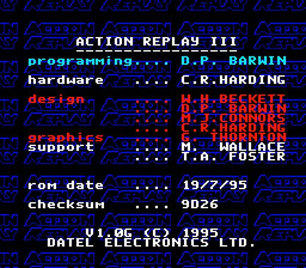

# Home of Pro Action Replay MK3 for SNES:
## The Ultimate Documentation Hub

---

### Discover the Full Power of the Action Replay MK3!

Whether you're a long-time fan who used the Action Replay MK3 back in the day - or you've just stumbled upon it for the first time - this remarkable device deserves a proper spotlight.

The MK3 was far more than a simple cheat cartridge. It was a clever blend of game enhancer, region adapter, and tinkering tool, letting players unlock hidden features, experiment with codes, and play import titles long before emulation made that easy. For many, it was a gateway into the world of game hacking and discovery - a small piece of hardware with a big personality.

Yet despite its importance, information about it has nearly vanished: manuals are inconsistent, scans are incomplete, and technical details have been scattered or lost. This page aims to change that - to collect, preserve, and share everything known about the Action Replay MK3.

Here you'll find:
- revised and up-to-date manuals (German / English)
- print-ready reproduction labels for your cartridge
- hi-res scans of the original box art, inserts and manuals
- background information on the built-in cheat database
- fully reverse engineered `DEADC0DES` - the most dangerous cheat codes of all time!
- the "Preservaction" project - a deep documentation of the MK3
- comparisons with other cheat devices and SNES region adapters

### Why did you make this?

I've been collecting SNES equipment for over 30 years, but the trigger to start this project was something else: In the last year I've spent a long time researching which region adapter might be the best. The search wasn't easy, as there isn't much information about it online. Then I came across a forum post that mentioned the Action Replay MK3 for the Super NES - which made me curious, as I already owned this cheat device. Was there a function I had overlooked!?

**Indeed!** The Pro Action Replay MK3 is my favorite SNES cheat device because it's much more like a Swiss Army knife:
- a region adapter
- a cheat code device
- a cheat code finder (trainer)
- a real-time opcode injector
- a cheat code database

And the best part: It has a user interface driven by mouse or joypad!

To help this remarkable piece of hardware gain the appreciation it deserves once again, I digitized and translated the manual, documented all the built-in codes, captured screenshots of every menu, reverse-engineered the mysterious `DEADC0DE` cheats, and collected even more information about this fascinating device.

Happy gaming

*Tim*

## Downloads

### Manuals

The original manual contains a few minor inaccuracies; a corrected version is available for download. Because the module's interface is in German, I've added a translation - but only the main text is translated. Menu names and messages remain in German to make navigation easier.

- [Manual (German Markdown, revised V2.1)](manual_de.md)
- [Manual (English Markdown, translation V2.1)](manual_en.md)
- [Scanned Manual (German PDF, 4.7MB)](./assets/action_replay_mk_iii_manual_scan.pdf)

#### High-Resolution Manual Scans

- [Unedited Scanned Singlesided Pages (ZIP, 300dpi, 24.6MB)](./assets/action_replay_mk_iii_manual_pages.zip)
- [Unedited Scanned Doublesided Pages (ZIP, 300dpi, 14.3MB)](./assets/action_replay_mk_iii_manual_scans.zip)
- [Altered Manual Cover Scan (PNG, 300dpi, 7.1MB)](./assets/action_replay_mk_iii_manual_cover_touched.png)

### Cartridge Labels (Repros)

To bring your Action Replay MK3 cartridge back to its original glory, I've included high-resolution printable labels. They're carefully recreated from the originals - perfect for replacing worn, damaged, or missing stickers:

- [Module Label (PNG)](./assets/action_replay_mk_iii_label.png)
- [Module Label (PDF)](./assets/action_replay_mk_iii_label.pdf)
- [Module Label (Adobe Illustrator 2024)](./assets/action_replay_mk_iii_label.ai)

### Boxart and Inserts (Scans)

If you are looking for the original Boxart - here we go. The scan is in high resolution (300dpi) and suitable for printing. The file size is relatively large (11.4MB) to preserve all details:

- [Boxart (PNG, 300dpi, 11.4MB)](./assets/action_replay_mk_iii_boxart_scan.png)

### Project 'Preservaction'

Since no (or very little) information, screenshots, and other details are available, I think it is important to preserve the Pro Action Replay 3 details. Therefore I started project 'Preservaction' to document all functions of the Action Replay MK3 - from the interface and operation to features hidden within the ROM. Take a look at [Project Preservaction](preservaction-toc.md)?

### All about DEADC0DE

Different from the regular cheatcodes you find `DEADC0DES` for the Action Replay beginning from MK II. They look very unusual, but a quick google research shows: Nothing.

This is interesting! A challenge! Why hasn't anyone delved into this yet? Oh, the nerd in me must have awakened. If you're interested in what deadcodes are (they're awesome, I can already tell you), check out the corresponding [reverse engineering](preservaction-reverse-engineering.md) documentation.

In case you just want to have a look at the known deadcodes, see the [deadcode overview](preservaction-deadc0de.md). There you'll find a list of all known deadcodes, including links to detailed analyses of each one.

### Built-In Codes

The Action Replay MK3 includes a built-in database of (cheat) codes. A total of `907` codes for `202` games are pre-installed on the module (version `V1.0G`). Alongside classics like A Link to the Past, Castlevania, Final Fight, and Street Fighter, it also features cheats for games that only later achieved cult status and are now considered "hidden gems" or "underrated": such as Blackthorne, Goof Troop, Lost Vikings and Mickey's Magical Quest.

Though, due to limited storage space, only the most essential codes were included, such as infinite lives, energy, or time. Additionally, there are codes that support region unlocking, effectively patching the software in real-time.

See a [list of all included games](preservaction-database.md) and the amount of integrated cheat codes.

Interestingly, there are **a few oddities**:
- `Mega lo Mania` is listed mistakenly as `Mage Lo Mania`.
- `Sküljagger: Revolt of the Westicans` is listed mistakenly as `Skulljagger`.
- `Eek! The Cat` is listed in the cheat code database mistakenly as `Sky Cat`.
- `Rampart` is listed mistakenly as `Ramparts`.
- The [cheat codes for `Street Racer`](./ui/cheats/170b-codes-street-racer-4.png) are labeled mistakenly as `No Description`.
- The [deadc0de for `Super Streetfighter II`](./deadc0de-super-streetfighter-2-us.md)
- Some games are listed under their Japanese or European titles but aren't marked with "`JAP`" or "`EU`" as others are. As a result, it's unclear which version the listed cheat codes apply to.
  - `Contra Spirits` (JAP) = `Contra III: The Alien Wars` (US)
  - `Dead Dance` (JAP) = `Tuff E Nuff` (US)
  - `Super SWIV` (JAP) = `Firepower 2000` (US)
  - `Wild Trax` (JAP) = `Stunt Race FX` (US)
  - `Desert Fighter` (EU) = `A.S.P.: Air Strike Patrol` (US)
  - `Mega lo Mania` (EU) = `Tyrants: Fight Through Time` (US)
  - `Rival Turf!` (INT) = `Rushing Beat` (JAP)
  - `Rushing Beat Shura` (JAP) = `Brawl Brothers` (US)
  - `Super Aleste` (JAP) = `Space Megaforce` (US)
  - `Super Pang` (JAP) = `Super Buster Bros` (US)
- There are also **some misleading simplifications**:
  - `90 Minutes - European Prime Goal` is listed as `Prime Goal`.
  - `Harley's Humongous Adventure` is listed as `Harleys Humongous Advent`.
  - `The Legend of Zelda - A Link to the Past` is listed as `Zelda III`.

#### More (Cheat-)Codes!

If you're looking for even more codes beyond what's built-in, check out [the SNES area at gamehacking.org](https://gamehacking.org/system/snes/), an excellent resource with a vast collection of codes for the SNES, including games that may not be covered by the built-in database.

## Further Insights

Besides the main info about the MK3's features, I've collected a few other tidbits and details that caught my eye while digging into the history of this fascinating cheat device.

### Secrets

#### Credits/Informations

Hold `A` as the Action Replay logo fades out to display a credits/information screen. This screen contains the program version, copyrights, build date, and checksum. While at this screen, the two cartridge `LEDs` will strobe.

> Note: [Credits/Source](https://tcrf.net/Pro_Action_Replay_MK3_(SNES))

#### Test Mode

Hold `Y` and `A` while booting/restarting the menu to enter a simple test mode. From here, pressing `B` will light up the two cartridge `LEDs` and then start the attached game with the code `7E001902` active.

> Note: [Credits/Source](https://tcrf.net/Pro_Action_Replay_MK3_(SNES))

#### Unused Routines

At CPU address `00D48B` (right after the text for the credits/info screen) is the string "THIS IS THE START OF THE END", followed by some no-longer-used routines which attempt to poll the values at CPU addresses `00D500` through `00D50F` as part of some unknown functionality.

### Module Overview: Front and Back Elements

Below are images of the *Action Replay MK3* module showing its front and back:

#### Front View

- **Switch**: This switch toggles the activation of the Action Replay's cheat functions.
- **LED A & LED B**: The two LEDs indicate the status of the module when it's active and when cheats are applied.
- **Cartridge Slot on Top**: This is where you insert your SNES game cartridge to enable cheats and region-free functionality.

#### Back View

- **Card Slot on Back**: This slot is essential when using a game from a different region. To enable compatibility with certain expansion chips (such as those used in certain region-specific games), you will need to insert a **donor module** in this slot. The donor module provides the necessary additional chips required for the imported game to run correctly on the SNES console.

#### PCB

Further pictures as well as information about the (Action Replay board and chipset)[preservaction-pcb.md] can be found in the documentation.

### Game Converters and Adapters

Many people search the internet for help finding a well-functioning cartridge adapter to play games from another region on a Super Nintendo. There are certainly a few decent options, but the best one is the Action Replay MK3. Most adapters don't support complex late-release games, don't pass through the cartridge's enhancement chips, and so on.

Have a look at the [comparison chart of game converters and adapters for Super Nintendo](converter-adapter-comparison.md).

---

## Legals

### Legacy Product Status

The **Action Replay MK3** has not been manufactured or distributed for many years. While it is no longer available for purchase through official channels, it is still widely appreciated by retro gamers and collectors. Since this product is no longer sold, it is often considered **abandonware**, meaning there are no current copyright or distribution restrictions for personal use. However, always check your local regulations regarding abandonware before distribution or modification of the provided media files and information.

### License

This repository, including the translated manuals, recreated labels, and any other documentation or media files, is released under the following license:

**Creative Commons Attribution-NonCommercial-ShareAlike 4.0 International (CC BY-NC-SA 4.0)**

You are free to:

- **Share**  -  copy and redistribute the material in any medium or format
- **Adapt**  -  remix, transform, and build upon the material

Under the following terms:

- **Attribution**  -  You must give appropriate credit, including the name of the original creator: Tim Böttiger. You must provide a link to the license and indicate if changes were made. You may do so in any reasonable manner, but not in any way that suggests the licensor endorses you or your use.
- **NonCommercial**  -  You may not use the material for commercial purposes.
- **ShareAlike**  -  If you remix, transform, or build upon the material, you must distribute your contributions under the same license as the original.

#### Exclusions

This license **does not apply** to:

- The original manual for the Action Replay MK3.
- The original label artwork for the Action Replay MK3.
- Any other trademarks or materials mentioned within the original manual.

These elements remain the intellectual property of their respective owners and are not covered by the license provided here.

For more details, you can view the full license at [https://creativecommons.org/licenses/by-nc-sa/4.0/](https://creativecommons.org/licenses/by-nc-sa/4.0/).
