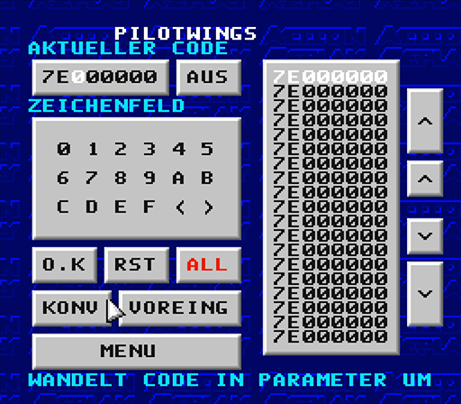
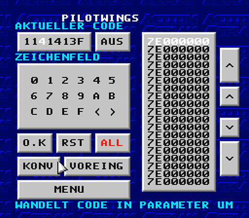

# Project Preservaction

[Table Of Contents](preservaction-toc.md)

## Action Replay Cheatcode Types

The **Action Replay** cheat format for the SNES (Super Nintendo Entertainment System) is a structured hexadecimal code that allows users to modify specific memory addresses during gameplay. This enables cheats such as infinite health, unlimited ammo, or unlocking items. There are various code formats known:

### Single-Line Codes

An Action Replay code on the SNES is typically structured as follows:

```
XXXXXX:YY
```

Where:
- **`XXXXXX`** is a 6-digit hexadecimal memory address that specifies where in the SNES's RAM the value will be modified.
- **`YY`** is a 2-digit hexadecimal value to be written to that address.

**Examples**

Here are some typical SNES Action Replay codes:

- `7E1490:09` **Infinite Lives**: Sets the player's life count to `09`.
- `7E0C28:63` **Max Health**: Sets the player's health to 99 (hexadecimal `63`).
- `7E0B4C:FF` **Unlimited Ammo**: Sets the player's ammunition to 255 (hexadecimal `FF`).

#### Special Single Line Codes

[Fullsnes Nocash SNES Specs](./docs/Fullsnes-Nocash_SNES_Specs.pdf) differentiates at page 314 between normal single line codes and special single line codes. The following text is extracted from the Fullsnes Documentation.

##### Do nothing

`7E000000` is the most important Pro Action Replay code (**required** as padding value, since the GUI doesn't allow to remove items from the code list):

##### Pre-boot WRAM patch (PAR1 only)

`FE0000xx..FFFFFFxx` writes xx to the corresponding WRAM address at `0x7E0000..0x7FFFFF`, this is done only once, and it's done **BEFORE** starting the game.

##### Disable Game's NMI handler (MK3 only)

`00600000` disables the game's NMI handler (executes only the NMI handler of the Pro Action Replay BIOS).

##### Changes to X-Terminator 2 (Unofficial)

`C0DEnn00` somehow changes the NMI (and IRQ) handling of the X-Terminator 2, "nn" can be `00..06`.

### Multi-Line Codes

Multi-line Action Replay codes are used to modify multiple memory addresses simultaneously. Each line targets a different address, allowing for more complex cheats:

```
XXXXXX:YY
XXXXXX:YY
```

Where:
- **`XXXXXX`** is 6-digit hexadecimal memory address that specifies where in the SNES's RAM the value will be modified.
- **`YY`** is 2-digit hexadecimal value to be written to that address.

**Example**

```
7E0C28:63
7E0C29:00
```

1. Line **Infinite Lives**: Sets the player's life count to `09`.
2. Line **Zero Damage**: Sets the player's damage to 0 (hexadecimal `00`).

### Deadcode Cheats

`DEADC0DE` cheats for the Action Replay are a unique and powerful class of cheats that are neither well-documented nor widely known — until now. These cheats stand apart from standard Action Replay codes due to their potential to significantly alter gameplay in complex ways beyond simple memory modifications.

Simple disassembly of the first blocks following `DEADC0DE` translate into strange or seemingly nonsensical instructions. The key is: They are not part of the actual code to be executed but rather serve as a setup or hook mechanism and contain a length information as well.

#### Code Format

**Header Structure**

The header format is fixed and always begins with the magic word `DEADC0DE`, followed by a structured `DWORD` (4-byte) block that contains a hook address to jump into the cheat code (this activates the execution of the cheat code and was also assumed by [Kodewerx](https://doc.kodewerx.org/hacking_snes.html)), and a length byte that indicates how many `DWORD` blocks follow (compare documented in the [Fullsnes Nocash SNES Specs](./docs/Fullsnes-Nocash_SNES_Specs.pdf) page 314):

```
  ______________________ Signature DWORD
 /  /  /  /
DE AD CO DE
9A 89 87 00
 \  \  \  \_____________ Length Byte (00 indicates variable length cheat code)
  \  \  \_______________ Lo Memory Address Byte
   \  \_________________ Hi Memory Address Byte
    \___________________ Bank Address Byte
```

> **Fullsnes Nocash SNES Specs** describes the handling of the hook address as follows: "...the ROM address AAAAAA is patched by a 4-byte 'JMP nnnnnn' opcode (doing a far jump to the address of the relocated SRAM code; this would be at `0x006A80` in PAR3, at `0x006700` in PAR2a/b, and isn't supported in PAR1)"

**Prologue Structure**

Prologue saves CPU state (A and P), sets 8-bit mode.

```
48 08 E2 30
 \  \  \__\_____________ Opcode SEP #$30 - Set Processor Status bits 0x30
  \  \__________________ Opcode PHP - Push Processor Status (P register / flags) onto the stack
   \____________________ Opcode PHA - Push Accumulator (A) onto the stack
```

`SEP #$30` sets M = 1 and X = 1, than means it switches A (accumulator) and index registers (X, Y) to 8-bit mode. This is common in SNES IRQ or hook routines to ensure consistent data width.

**Cheat Code Block**

This overwrites the existing value at $7E:7024 with 00, replacing whatever was there before.

```
A9 00 8F 24
 \  \  \  \_____________ Low Address Byte - Part of the STA instruction
  \  \  \_______________ Opcode STA - Store A to WRAM address $7E:7024
   \__\_________________ Opcode LDA #$00 - Load immediate 0 into A.
70 7E EA EA
 \  \  \__\_____________ Opcode NOP - Padding (Ignored)
  \  \__________________ Bank Address Byte - Part of the STA instruction
   \____________________ High Address Byte - Part of the STA instruction
```

**Epilog Structure**

Epilog restores CPU state/mode, acknowledges IRQ, and jumps back to $C0:FD15.

```
28 68 AF 11
 \  \  \  \_____________ Low Address Byte - Part of the LDA instruction
  \  \  \_______________ Opcode LDA - Load A from address
   \  \_________________ Opcode PLA - Pull (Restore) Accumulator
    \___________________ Opcode PLP - Pull (Restore) Processor Status
42 00 5C 15
 \  \  \  \_____________ Low Address Byte - Part of the JML instruction
  \  \  \_______________ Opcode JML - Long Jump to address
   \  \_________________ Bank Address Byte - Part of the LDA instruction
    \___________________ High Address Byte - Part of the LDA instruction
FD C0 00 00
 \  \  \__\_____________ Opcode NOP - Padding (Ignored)
  \  \__________________ Bank Address Byte - Part of the JML instruction
   \____________________ High Address Byte - Part of the JML instruction
```

#### Fixed-Length Deadcode Cheats

Fixed-Length `DEADC0DE` cheats: The last byte of the address line is greater than `00`, followed by the exact number of `DWORD` blocks defined by that last address-line byte.

#### Variable-Length Deadcode Cheats

Variable-Length `DEADC0DE` cheats: The last byte of the address line is `00`, followed by an undefined number of `DWORD` Cheat Code Blocks.

These cheats have a clear structure:
1. Header (always 8 bytes)
2. Prologue
3. `n` Cheat Code Blocks (mostly 8 bytes)
4. Epilog

The **Prologue** prepares the CPU state in the way required by the Cheat Code Blocks, while the **Epilogue** restores it to the state expected by the game. The **Cheat Code Blocks** contain the actual (mostly simple) cheat logic, but they can vary in both length and complexity.

## Game Genie

In addition to the PAR code format, Pro Action Replay also supports **Game Genie** codes. The **MK3** model of the Action Replay device includes a feature that can convert up to 5 Game Genie codes into Action Replay format. In this case it works like a Game Genie and modifies the game's ROM.

The **Game Genie** is a cheat device for the SNES that operates differently from the **Action Replay**. While both devices are used to modify game data to enable cheats, they do so in distinct ways and have unique code formats:

Game Genie codes work by intercepting game code instructions from the cartridge ROM before they reach the console, allowing modification of hardcoded values, such as lives, power-ups, or enemy strength.

Unlike Action Replay codes, which directly specify memory addresses and values, Game Genie codes use an encryption algorithm to obscure the actual memory address and value. This encryption was designed to prevent players from easily discovering and modifying memory addresses without using the Game Genie device, adding a layer of security and control over the cheat codes.

### Code Format

A typical SNES Game Genie code consists of 8 characters and follows the structure:

`XXXX-YYYY`

Each code defines a modification to the game’s ROM (Read-Only Memory) data.

- `XXXX` : Address offset within the game ROM.
- `YYYY` : Value to be substituted at the specified address.

After decryption, the resulting code contains:
- A 24-bit memory address (`XXXXXX`)
- An 8-bit value (`YY`)

> The target address can be located in ROM or SRAM memory. Internal WRAM locations are not supported.

### Hex Mapping
Game Genie uses a modified hexadecimal alphabet. To decode, replace each "GG-Hex" digit with its corresponding standard hexadecimal value:

```
GG-Hex:     D F 4 7 0 9 1 5 6 B C 8 A 2 3 E
Normal Hex: 0 1 2 3 4 5 6 7 8 9 A B C D E F
```

### Address Bit Mapping
After conversion, the address portion (`AAAAAA`) must be bit-descrambled as follows:

```
ijklqrst opabcduv wxefghmn   ; Genie Address (i = Bit23 … n = Bit0)
abcdefgh ijklmnop qrstuvwx   ; SNES Address  (a = Bit23 … x = Bit0)
```

> The encryption of codes make it impossible to reference codes with placeholders (like "Start in Level NN"). Instead, users have to create separate codes for each level.

The Pro Action Replay MK3 includes a "CONV" button for converting Game Genie codes:




> Manually decrypted Game Genie codes would also work on PAR MK2 (although the PAR MK2 won't allow to use five ROM patches at once).

### Other Cheat Code Devices

Other cheat code devices do not directly belong to the Action Replay family but are included to complete the cheat code format section.

#### Gold Finger / Goldfinger

The Gold Finger code format defines memory modification instructions for ROM and SRAM areas in supported copier devices.
Each code follows the structure:

`AAAAADDEEFFCCW`

| Field    | Description                                                                                                           |
|----------|-----------------------------------------------------------------------------------------------------------------------|
| `AAAAA`  | The ROM address represents the offset within the ROM image, excluding any `0x200`-byte header.                        |
| `DDEEFF` | If fewer than 3 data bytes are used, pad the unused fields with `XX` (Padded values = 0 during checksum calculation). |
| `CC`     | Checksum byte, calculated as described below.                                                                         |
| `W`      | Area indicator that specifies whether the data applies to the `ROM` or `SRAM` area.                                   |

The checksum (CC) is calculated via hexadecimal arithmetic as follows:

```
CC = A0h + (AAAAA / 10000h) + (AAAAA / 100h) + AAAAA + DD (+ EE (+ FF))
```

The final character `W` defines the memory area affected by the code:

| `W` Value | Target Area             |
|-----------|-------------------------|
| `0`       | DRAM (ROM image)        |
| `1`       | SRAM (Save game memory) |

Values `2`, `8`, `A`, `C`, and `F` may also correspond to `DRAM` (ROM image), depending on device behavior.

> The 5-digit address field provides access to a maximum of 1 MByte within the ROM image. For LoROM mappings, the first byte is located at address 00000h. The address represents a ROM offset rather than a CPU address.

#### Front Far East

The Front Far East code format defines data modification instructions for ROM memory areas in compatible Front Far East copier devices. Each code follows the structure:

`NNAAAAAADD..`

| Field    | Description                                                                                               |
|----------|-----------------------------------------------------------------------------------------------------------|
| `NN`     | Number of data bytes (1–36). This determines how many bytes are modified.                                 |
| `AAAAAA` | ROM address (6 digits). Represents a 24-bit offset within the ROM image, excluding any 0x200-byte header. |
| `DD..`   | Data bytes to be written to the specified address.                                                        |

Depending on the number of bytes, the total code length ranges from `10` to `80` digits. To differentiate this format from the `14`-digit Gold Finger codes, Front Far East codes may use a `G` prefix before Gold Finger entries.

> The address field provides access within the ROM image. The offset is linear (non-interleaved) and directly corresponds to the ROM data layout.
