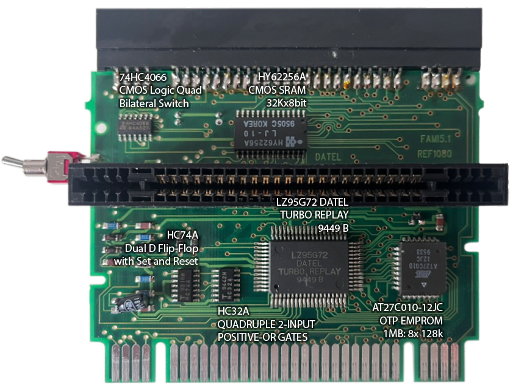

# Project Preservaction

[Table Of Contents](preservaction-toc.md)

## Printed Circuit Board (PCB)

**Download:** [PCB-Image without descriptions](./assets/pcb-pure.png)

### Components

- **74HC4066 - CMOS Logic Quad Bilateral Switch:** The 74HC4066 is a logic IC containing four bidirectional switches. It's often used in digital circuits to selectively switch and route signals. In this module, it may be used to switch between different signal paths or data sources depending on the switch position or selected functions.
- **HY62256A - CMOS SRAM 32Kx8bit:** This is a static RAM (SRAM) chip with a storage capacity of 32 kilobytes, organized in 32Kx8-bit cells. SRAM chips store data temporarily and are ideal for holding cheat data, settings, or intermediate values for parameters in real-time. It is the exchange space between the ROM interface (SNES runtime) and the custom Datel IC.
- **LZ95G72 - DATEL TURBO REPLAY:** The 64 pin LZ95G72 is the heart of the module and is likely a specialized microcontroller or custom IC from DATEL, designed specifically for cheat and region-bypass functions. It retrieves user data stored by the ROM in SRAM, processes cheats, operates the trainer, injects dead codes and controls the module's overall functionality.
  - You can assume that it wouldn't have been cost-effective to develop the Action Replay from the ground up for a wide range of consoles. There's a reason why the PCB layout looks similar. Before the chips were labeled as Datel, identical ones (1) were marked as SHARP in other documents.
- **HC74A - Dual D Flip-Flop with Set and Reset:** The HC74A is a Dual D Flip-Flop IC, used in digital circuits to store and stabilize states. The Flip-Flop can be controlled by set and reset signals, and could be used here to store cheat states (e.g., which cheats are active), keeping them consistent even through game inputs.
- **HC32A - Quadruple 2-Input Positive-OR Gates:** This chip contains four 2-input OR gates and is a logic component used to combine signals based on OR logic in digital circuits. It might be used to combine logic signals required for activating cheats or controlling certain module settings.
- **AT27C010-12JC - OTP EPROM 1MB:** The AT27C010 is a one-time programmable memory chip (EPROM) with a storage capacity of 1 Megabit. It is used to store the hard-coded programs and data for the module, such as the SNES firmware (ROM with user interface and pre-installed cheat codes. The EPROM also contains the firmware (cheat runtime) of the custom IC that controls the module's behavior.

> Credits/Source
    (1) [Jungsi (german)](https://www.jungsi.de/pro-action-replay-2-sega-megadrive/)

### 3-Way Toggle Switch and Its Functions

The **3-way toggle switch** on the side of the Pro Action Replay MK3 module controls the different operating modes of the module and allows switching between the following positions:

1. **Top Position:**
   - This position activates **parameters**, the **slow-motion function**, and the **trainer**. In this mode, cheats can be applied, and the game can be slowed down using the slow-motion feature.
   - During gameplay, the trainer can be used to locate memory addresses for specific values (e.g., lives or energy) and adjust them.
   - Here, the custom Datel Chip is leading

2. **Middle Position:**
   - This position turns off the Action Replay, placing it in pass-through mode. The game runs unmodified without any cheat or modification functions.
   - This is the default mode when no modifications to the game are desired.
   - Both the custom Datel IC (cheat runtime) and the ROM (SNES runtime) are inactive

3. **Bottom Position:**
   - This position enables the **parameter input mode** and displays the Action Replay's main menu. In this mode, users can enter cheat codes, activate the adapter function for games from other regions, and adjust other settings.
   - Through the menu, parameters can be selected or entered, which will later be applied in cheat mode.
   - All what is happening here is gathering user input and saving it to the CMOS SRAM to be available for the Datel IC in cheat mode.

### Hypothetical Analysis of Chip Interaction

Based on the known functions of the module and the analyzed hardware, the following explanation is purely **speculative** about how the chips might work together:

- **Signal Flow and Mode Control:** The **74HC4066** is likely controlled by the 3-way switch and acts as a central switch for the various modes. Depending on the switch position, it routes signals and determines which chips are active. For example, in the top position, it might activate the custom IC, in the middle position pass-through, and in the bottom position it executes the SNES ROM.

- **Processing and Control by the Main Chip:** The **LZ95G72** acts as the central control unit, coordinating the cheat and region-bypass functions. It reads data from the EPROM and activates or deactivates the SRAM and other chips depending on the selected mode. In combination with the **HC74A** Flip-Flop, it keeps track of active cheats and applies them consistently during gameplay.

- **Memory and Logic Processing:** The **HY62256A (SRAM)** temporarily stores active cheat data and settings that the module applies during gameplay. The **HC32A** OR gate chip combines logic signals to determine if a cheat is active and if the Action Replay should actively modify the game code. It is a shared memory of both ROM and custom IC.

- **Storage and Program Access:** The **AT27C010 EPROM** holds the main program (IC firmware; BIOS) and the user interface (ROM) for the Action Replay.

However, the exact technical implementation remains unknown.
