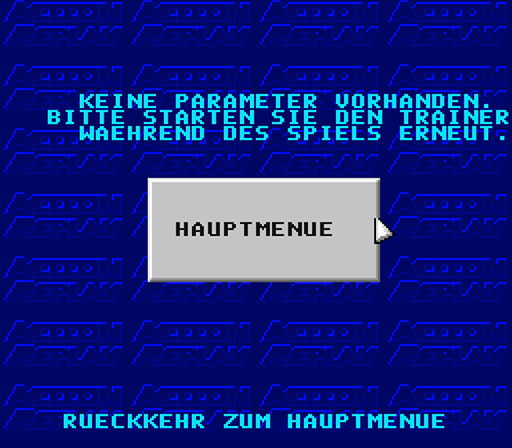
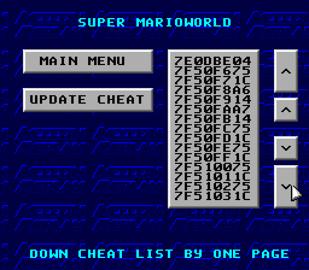
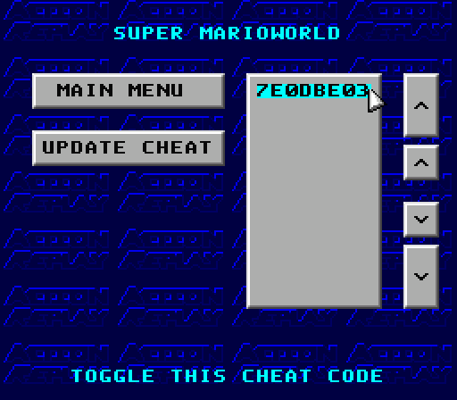

# Project Preservaction

[Table Of Contents](preservaction-toc.md)

## How the Trainer Works

The trainer is a **relative-value memory search** ("Code Finder"): you never
need to know a value's absolute number, only whether it went up or down. It runs
inside the PAR NMI handler every frame, so it can watch the game's work RAM
live. For the full disassembly-level mechanics (input decode, comparison modes,
the WRAM scan, and the LED engine) see
[ROM disassembly section 20](preservaction-rom-disassembly.md).

### Controls

The trainer is operated entirely with controller-1 button combinations during
the game. Hold `Select` (the default trainer button; switchable to `Start` in
the options) and tap the second button:

| Combination        | Function                                   | Internal    |
|--------------------|--------------------------------------------|-------------|
| `Select` + `X`     | Start trainer / "same value as before"     | `$61AE = 0` |
| `Select` + `Y`     | "Value lower than before"                  | `$61AE = 1` |
| `Select` + `A`     | "Value higher than before"                 | `$61AE = 2` |
| `Select` + `B`     | "Absolutely different value"               | `$61AE = 3` |
| `Select` + `R`     | Activate the found parameter               | `jsr $74E7` |
| `Select` + `Start` | Clear the trainer                          | `jmp $749F` |

A typical search: start with `Select`+`X`, change the value in-game, then press
the combo matching the direction it moved (lower/higher/same/different). Slow 
blinking means several candidates are still in play. Repeat until **LED 2 blinks
fast** (a single candidate remains), then `Select`+`R` to freeze it as a cheat. 

> Not every game is trainer-compatible. If the tracked value is relocated or double-buffered, the search never converges and LED 2 stays on. This is a property of the game, not a fault of the adapter.

## Trainer Screenshots

### No Parameters

[Detail Screens](preservaction-ui-mainmenu.md)

### Many Parameters

Multiple candidates remain after the first comparison — LED 2 blinks slowly.
Keep narrowing the search by repeating the lower/higher/same/different combo.

### Single Parameter

Only one candidate remains — LED 2 blinks fast. Press `Select`+`R` to freeze
this address as an active cheat.

