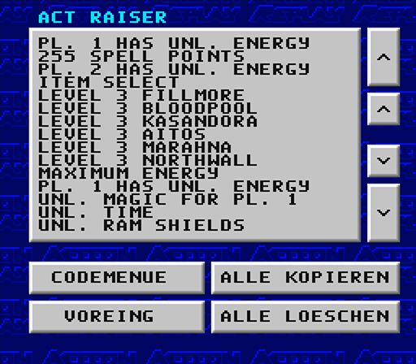
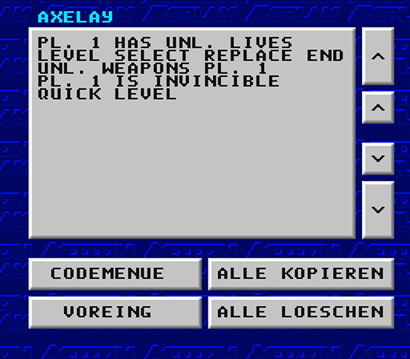
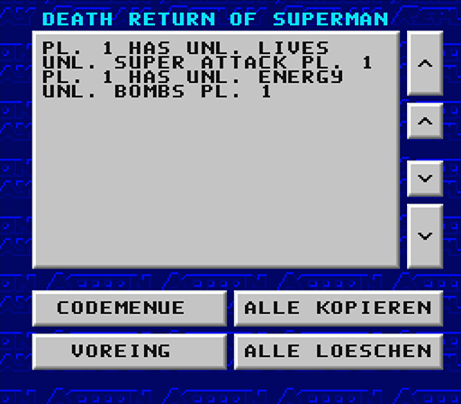
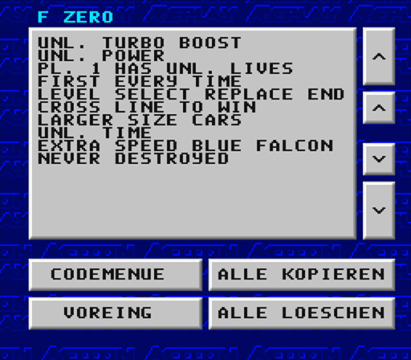
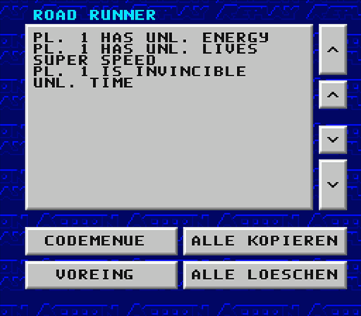

# Project UI Preservaction

[Table Of Contents](project-uip-toc.md)

[Game List](project-uip-games.md)

[Code Editor](project-uip-codes.md)

## Cheat Screenshots

### 1. ACROBAT MISSION

### 2. ACTRAISER

### 3. ACTRAISER II

### 4. ADAMS FAMILY
> Note: The correct game title is "The Addams Family".

### 5. ADAMS FAMILY II
> Note: The correct game title is "The Addams Family: Pugsley's Scavenger Hunt".

### 6. ADVENTURE ISLAND

### 7. AERO THE ACROBAT

### 8. ALADDIN

### 9. ALIEN 3

### 10. ART OF FIGHTING

### 11. ASTERIX

### 12. AXELAY

### 13. BARTS NIGHTMARE
> Note: The correct game title is "The Simpsons: Bart's Nightmare".

### 14. BATMAN RETURNS

### 15. BATTLE CLASH

### 16. BATTLETOADS

### 17. BEAVIS AND BUTTHEAD
> Note: The correct game title is "Beavis and Butt-Head".

### 18. BEST OF THE BEST
> Note: The correct game title is "Best of the Best: Championship Karate".

### 19. BLACKTHORNE

### 20. BLAZEON

### 21. B.O.B.

### 22. BOXING LEGENDS RING
> Note: The correct game title is "Boxing Legends of the Ring".

### 23. BRAWL BROTHERS

### 24. BUBSY
> Note: The correct game title is "Bubsy in Claws Encounters of the Furred Kind".

### 25. BUGS BUNNY RAMPAGE
> Note: The correct game title is "The Bugs Bunny Rabbit Rampage".

### 26. BULLS VS BLAZERS

### 27. BUSTER BUSTS LOOSE
> Note: The correct game title is "Tiny Toon Adventures: Buster Busts Loose!"

### 28. CASTLEVANIA IV
> Note: The correct game title is "Super Castlevania IV".

### 29. CHAOS ENGINE

### 30. CHOPLIFTER II

### 31. CHOPLIFTER III

### 32. CLAYMATES

### 33. CONTRA SPIRITS
> Note: The correct game title in North America is "Contra III: The Alien Wars". "Contra Spirits" is the japanese version of the title.

### 34. COOL SPOT

### 35. COOL WORLD

### 36. CRASH DUMMIES
> Note: The correct game title is "The Incredible Crash Dummies".

### 37. CYBERNATOR

### 38. CYBERNATOR DEADCODE

### 39. DAFFY DUCK
> Note: The correct game title is "Daffy Duck: The Marvin Missions".

### 40. DARIUS TWIN

### 41. D. CRANES AMAZING TENNIS
> Note: The correct game title is "David Crane's Amazing Tennis".

### 42. DEAD DANCE
> Note: The correct game title in North America is "Tuff E Nuff". "Dead Dance" is the japanese version of the title. 

### 43. DEATH RETURN OF SUPERMAN
> Note: The correct game title is "The Death and Return of Superman".

### 44. DESERT FIGHTER
> Note: The correct game title outside Europe (in the US) is "A.S.P.: Air Strike Patrol".

### 45. DESERT STRIKE

### 46. DIMENSION FORCE

### 47. DINOSAURS
> Note: The correct game title is "Hungry Dinosaurs".

### 48. DONKEY KONG COUNTRY UK
> Note: The correct game title is "Donkey Kong Country".

### 49. DRACULA
> Note: The correct game title is "Bram Stoker's Dracula".

### 50. DRAGON BALL Z

### 51. DRAGON BALL Z II

### 52. DRAGONS LAIR
> Note: The correct game title is "Dragon's Lair".

### 53. DR FRANKEN
> Note: The correct game title is "Dr. Franken".

### 54-57. DUNGEON MASTER
> Note: The correct game title is "Dungeon Master".

### 54. DUNGEON MASTER CHARACTER ONE

#### 55. DUNGEON MASTER CHARACTER TWO

#### 56. DUNGEON MASTER CHARACTER THREE

#### 57. DUNGEON MASTER CHARACTER FOUR

### 58. EARTHWORM JIM

### 59. EARTHWORM JIM US

### 60. EQUINOX

### 61. EYE OF THE BEHOLDER
> Note: The correct game title is "Advanced Dungeons & Dragons: Eye of the Beholder".

### 62. EXHAUST HEAT

### 63. EXHAUST HEAT II

### 64. FACEBALL 2000

### 65. FAMILY DOG

### 66. FATAL FURY

### 67. FATAL FURY II

### 68. FINAL FANTASY II

### 69. FINAL FIGHT

### 70. FINAL FIGHT II

### 71. FIRST SAMURAI

### 72. FLASHBACK

### 73. FLINTSTONES
> Note: The correct game title is "The Flintstones: The Treasure of Sierra Madrock".

### 74. FLYING HERO

### 75. F ZERO
> Note: The correct game title is "F-Zero".

### 76. GEORGE FOREMAN KO BOXING
> Note: The correct game title is "George Foreman's KO Boxing".

### 77. GHOULS N GHOSTS
> Note: The correct game title is "Super Ghouls 'n Ghosts".

### 78. GOAL

### 79. GODS

### 80. GOOF TROOP

### 81. GRADIUS III

### 82. GUN FORCE

### 83. HARLEYS HUMUNGOUS ADVENTURE
> Note: The correct game title is "Harley's Humongous Adventure".

### 84. HOLE IN ONE GOLF
> Note: The correct game title is "Hal's Hole in One Golf".

### 85. HOME ALONE

### 86. HOOK

### 87. HUMAN GRAND PRIX

### 88. HUNT FOR RED OCTOBER
> Note: The correct game title is "The Hunt for Red October".

### 89. HYPER ZONE

### 90. ILLUSION OF GAIA

### 91. IMPERIUM

### 92. INCREDIBLE HULK
> Note: The correct game title is "The Incredible Hulk".

### 93. INSPECTOR GADGET

### 94. JAKI CRUSH

### 95. JOE AND MAC II
> Note: The correct game title is "Joe & Mac 2: Lost in the Tropics".

### 96. JUNGLE BOOK
> Note: The correct game title is "Disney's The Jungle Book".

### 97. JURASSIC PARK

### 98. JURASSIC PARK II
> Note: The correct game title is "Jurassic Park Part 2: The Chaos Continues".

### 99. KEVIN KEEGAN
> Note: The correct game title is "Kevin Keegan's Player Manager".

### 100. KNIGHTS OF THE ROUND

### 101. KRUSTYS FUN HOUSE
> Note: The correct game title is "Krusty's Super Fun House".

### 102. LAGOON

### 103. LAMBORGHINI
> Note: The correct game title is "Lamborghini American Challenge".

### 104. LAWN MOWER MAN
> Note: The correct game title is "The Lawnmower Man".

### 105. LEMMINGS

### 106. LETHAL WEAPON

### 107. LION KING
> Note: The correct game title is "Disney's The Lion King".

### 108. LOST VIKINGS
> Note: The correct game title is "The Lost Vikings".

### 109. MAGE LO MANIA
> Note: The correct game title is "Mega Lo Mania".

### 110. MAGIC SWORD

### 111. MAXIMUM CARNAGE
> Note: The correct game title is "Spider-Man and Venom: Maximum Carnage".

### 112. MECHWARRIOR

### 113. MEGAMAN SOCCER

### 114. MEGAMAN X

### 115. METAL MARINES

### 116. MICKEY AND MINNIE
> Note: The correct game title is "The Great Circus Mystery Starring Mickey & Minnie".

### 117. MICKEYS MAGICAL QUEST
> Note: The correct game title is "The Magical Quest Starring Mickey Mouse".

### 118. MICKEY MANIA
> Note: The correct game title is "Mickey Mania: The Timeless Adventures of Mickey Mouse".

### 119. MISTER NUTZ

### 120. MOLE PATROL

### 121. MYSTICAL NINJA
> Note: The correct game title is "The Legend of the Mystical Ninja".

### 122. MYSTICAL NINJA II JAP
> Note: The correct game title is "Ganbare Goemon 2: Kiteretsu Shōgun Magginesu" (Japanese release).

### 123-125. NIGEL MANSELL
> Note: The correct game title is "Nigel Mansell's World Championship Racing".

#### 124. NEW VERSION

#### 125. CHEATS

### 126. NINJA WARRIORS

### 127. OUT TO LUNCH

### 128. PARODIUS
> Note: The correct game title is "Parodius: Non-Sense Fantasy".

### 129. PHALANX

### 130. PILOTWINGS

### 131. PINBALL DREAMS

### 132. PINK PANTHER
> Note: The correct game title is "The Pink Panther Goes to Hollywood".

### 133. PITFALL
> Note: The correct game title is "Pitfall: The Mayan Adventure".

### 134. PITFALL 82 VERSION
> Note: The correct game title is "Pitfall!"

### 135. PIT FIGHTER

### 136. PLOK

### 137. POCKY AND ROCKY

### 138. POP N TWINBEE

### 139. POP N TWINBEE II
> Note: The correct game title is "Pop'n TwinBee: Rainbow Bell Adventures".

### 140. POWER RANGERS
> Note: The correct game title is "Mighty Morphin Power Rangers".

### 141. PRINCE OF PERSIA

### 142. PRIME GOAL
> Note: The correct game title is "90 Minutes - European Prime Goal".

### 143. Q BERT 3
> Note: The correct game title is "Q*BERT 3".

### 144. RAIDEN TRAD

### 145. RAMPARTS
> Note: The correct game title is "Rampart".

### 146. REN AND STIMPY
> Note: The correct game title is "The Ren & Stimpy Show: Time Warp".

### 147. RETURN OF THE JEDI
> Note: The correct game title is "Super Star Wars: Return of the Jedi".

### 148. RISE OF THE ROBOTS

### 149. RIVAL TURF
> Note: The correct game title is "Rushing Beat" (Japanese title) or "Rival Turf!" (international title).

### 150. ROAD RIOT
> Note: The correct game title is "Road Riot 4WD".

### 151. ROAD RUNNER
> Note: The correct game title is "Road Runner's Death Valley Rally".

### 152. ROBOCOP III

### 153. ROBOCOP VS TERMINATOR

### 154. ROCK N ROLL RACING

### 155. R-TYPE

### 156. R-TYPE III
> Note: The correct game title is "R-Type III: The Third Lightning".

### 157. RUN SABER

### 158. RUSHING BEAT
> Note: The correct game title is "Rushing Beat Shura" (Japanese title) or "Brawl Brothers" (international title).

### 159. SKULLJAGGER
> Note: The correct game title is "Sküljagger: Revolt of the Westicans".

### 160. SKY BLAZER
> Note: The correct game title is "Skyblazer".

### 161. SKY CAT
> Note: The correct game title is "Eek! The Cat".

### 162. SONIC BLASTMAN

### 163. SPACE MEGAFORCE

### 164. SPANKYS QUEST

### 165. SPARKSTER

### 166. SPIN DIZZY
> Note: The correct game title is "Spindizzy Worlds".

### 167. STAR TREK TNG
> Note: The correct game title is "Star Trek: The Next Generation - Future's Past".

### 168. SUPER STREETFIGHTER
> Note: The correct game title is "Super Street Fighter II".

### 169. SUPER STREETFIGHTER TURBO
> Note: The correct game title is "Super Street Fighter II Turbo".

### 170. STREET RACER

> The cheat codes for `"Street Racer"` are labeled mistakenly as `"No Description"`:

Here are the missing names of the cheat codes:
  - `7E16F110` - Infinite turbos
  - `7E16F310` - Unlimited turbos for player 2
  - `7E1BCF01` - Unlimited laps
  - `7E18C9XX` - Track Select (XX = 00-17)

### 171. STRIKER

### 172. STUNT RACE FX EUR

### 173. STUNT RACE FX USA

### 174. SUNSET RIDERS

### 175. SUPER ADVENTURE ISLAND

### 176. SUPER ALESTE
> Note: The correct game title is "Space Megaforce" in North America.

### 177. SUPER BOMBER MAN
> Note: The correct game title is "Super Bomberman".

### 178. SUPER BOMBER MAN II
> Note: The correct game title is "Super Bomberman 2".

### 179. SUPER KICK OFF

### 180. SUPER MARIO ALLSTARS
> Note: The correct game title is "Super Mario All-Stars".

-7.png)
-7.png)

### 183. SUPER PANG
> Note: The correct game title in North America is "Super Buster Bros".

### 184. SUPER PUNCH-OUT

### 185. SUPER PUTTY JAP
> Note: The correct game title is "Super Putty".

### 186. SUPER SMASH TV

### 187. SUPER STAR WARS

### 188. SUPER STRIKE GUNNER

### 189. SUPER SWIV
> Note: The correct game title is "Firepower 2000" in North America.

### 190. SUPER TURRICAN

### 191. SUPER VALIS IV

### 192. SUPER WIDGET

### 193. TOM AND JERRY
> Note: The correct game title is "Tom and Jerry (and Tuffy)".

### 194. ULTRA MAN
> Note: The correct game title is "Ultraman: Towards the Future".

### 195. UNIVERSAL SOLDIER

### 196. VORTEX

### 197. WAYNES WORLD
> Note: The correct game title is "Wayne's World".

### 198. WILDTRAX
> Note: The correct game title outside Japan is "Stunt Race FX".

### 199. WIZARD OF OZ
> Note: The correct game title is "The Wizard of Oz".

### 200. WORLDCUP STRIKER

### 201. WRESTLEMANIA
> Note: The correct game title is "WWF WrestleMania: The Arcade Game".

### 202. XARDION

### 203. X ZONE

### 204. YOSHIS SAFARI

### 205. YS III
> Note: The correct game title is "Ys III: Wanderers from Ys".

### 206. ZELDA III
> Note: The correct game title is "The Legend of Zelda: A Link to the Past".

### 207. ZOOL

