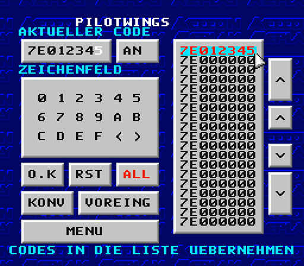
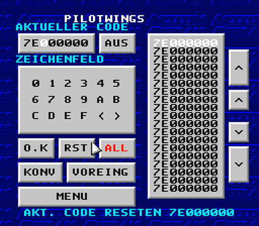

# Project Preservaction

[Table Of Contents](project-uip-toc.md)

## Code Editor Screenshots

### Return To Main Menu

[Detail Screens](project-uip-mainmenu.md)

### UI Elements

#### List

##### Select Code (Unsaved)

##### Select Code (Saved)

##### Hover Second Code

##### Select Second Code

#### Navigation

##### Page Up

##### Game Up

##### Game Down

##### Page Down

### Editor

#### Code Input

#### Group

#### Numberpad

#### Actions

##### OK (Save)

##### Reset Selected

> Note: This action needs to be **NOT** confirmed.

##### Reset List (Delete)

> Note: This action needs to be confirmed.

##### Convert Game Genie To Action Replay Code

#### Open Code Database

[Detail Screens](project-uip-cheats.md)

