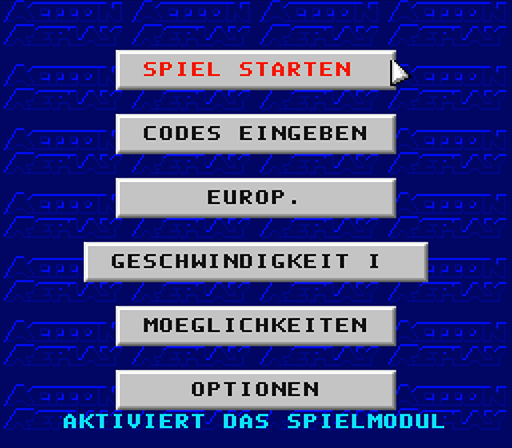
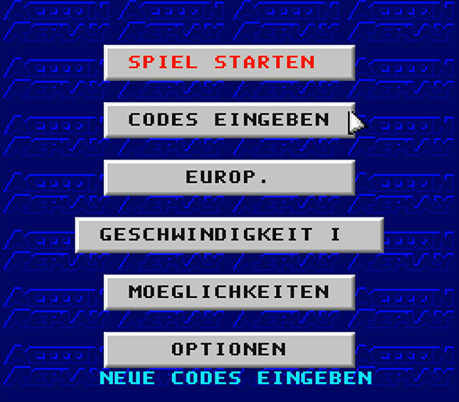
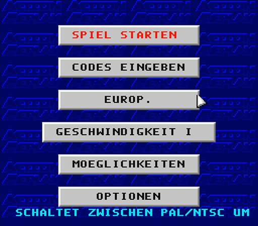
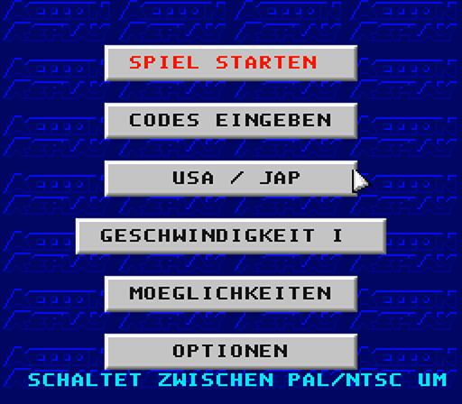
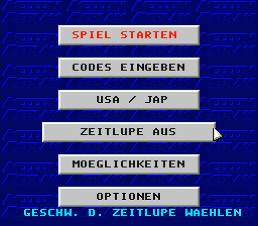
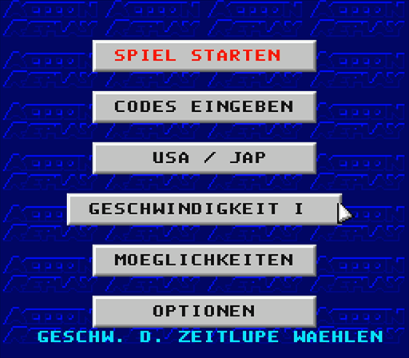
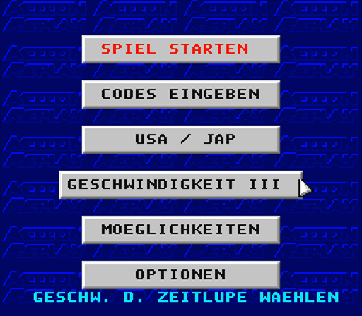
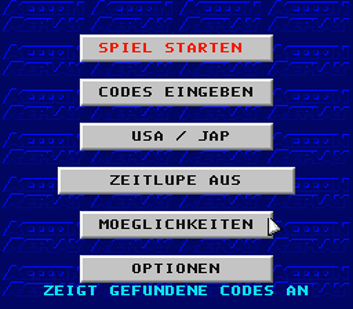
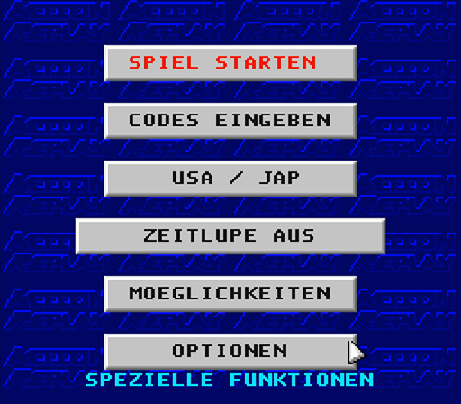

# Project UI Preservaction

[Table Of Contents](project-uip-toc.md)

## Main Menu Screenshots

### Start Game

### Codes

[Detail Screens](project-uip-codes.md)

### Region

#### Europe

#### USA / Japan

### Slow Motion

#### Off

#### Speed I

#### Speed II

#### Speed III

### Trainer

[Detail Screens](project-uip-trainer.md)

### Options

[Detail Screens](project-uip-options.md)

