# Project Preservaction

[Table Of Contents](project-uip-toc.md)

## Option Screenshots

### Return To Main Menu

[Detail Screens](project-uip-mainmenu.md)

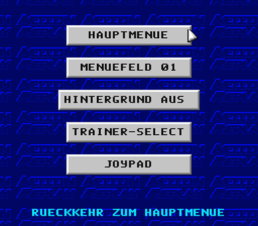

### Button Style Options

#### Style 1

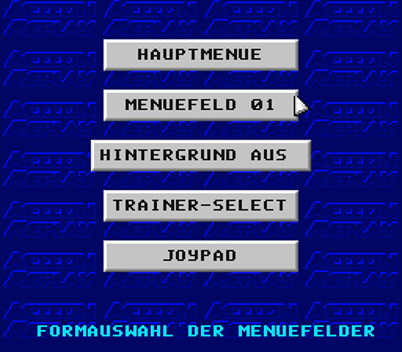

#### Style 2

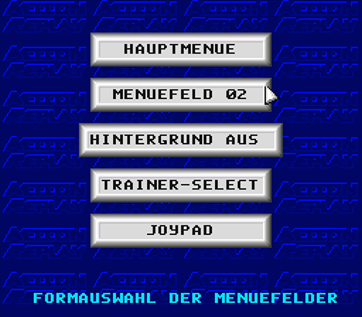

#### Style 3

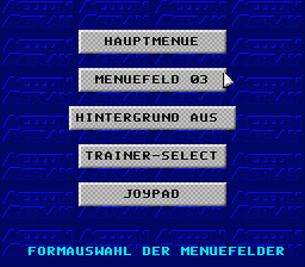

#### Style 4

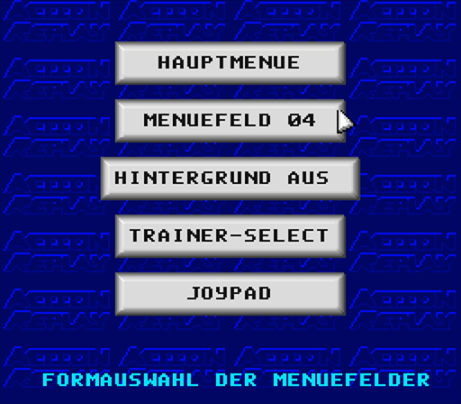

#### Style 5

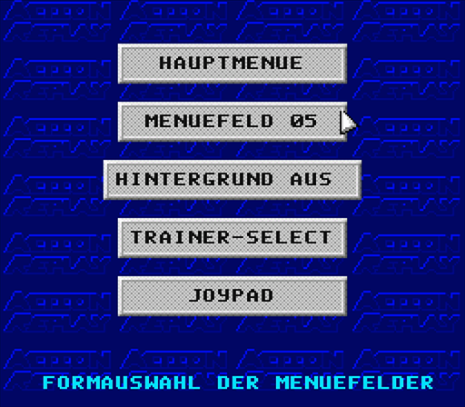

#### Style 6

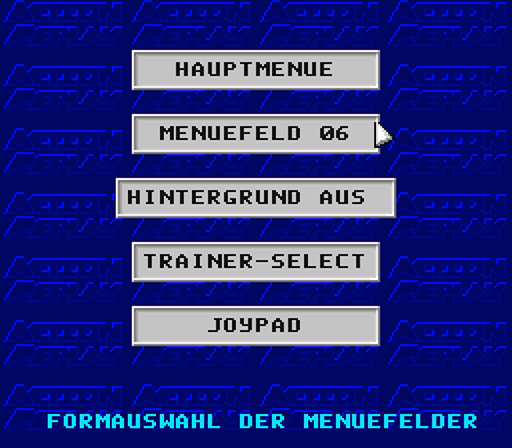

#### Style 7

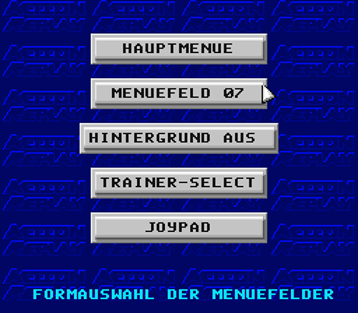

### Background Animation

#### On

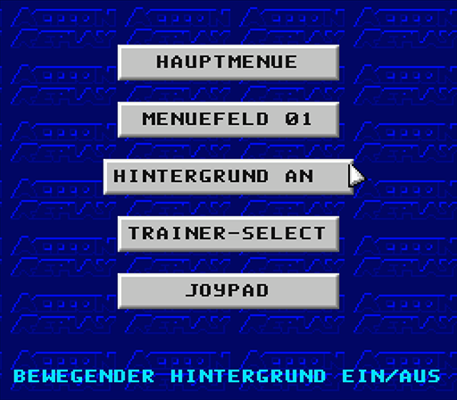

#### Off

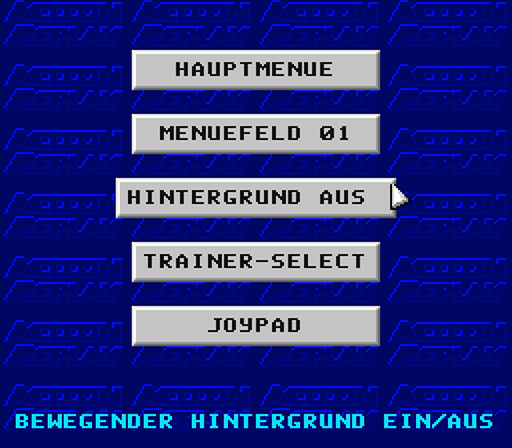

### Trainer Button

#### START

#### SELECT

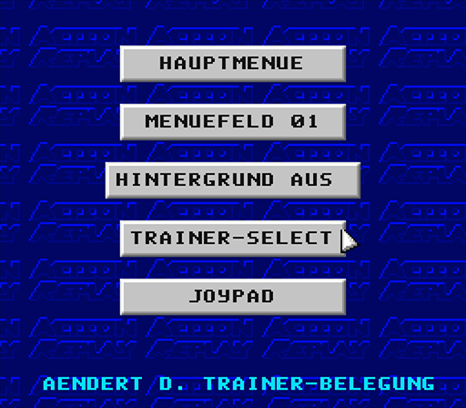

### Joypad

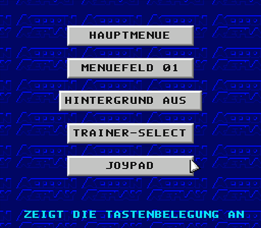

#### Details

