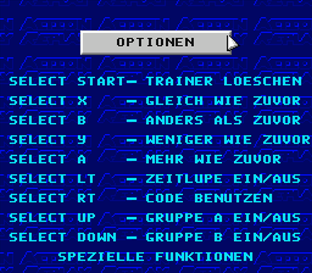

# Project Preservaction

[Table Of Contents](project-uip-toc.md)

## Option Screenshots

### Return To Main Menu

[Detail Screens](project-uip-mainmenu.md)

### Button Style Options

#### Style 1

#### Style 2

#### Style 3

#### Style 4

#### Style 5

#### Style 6

#### Style 7

### Background Animation

#### On

#### Off

### Trainer Button

#### START

#### SELECT

### Joypad

#### Details

